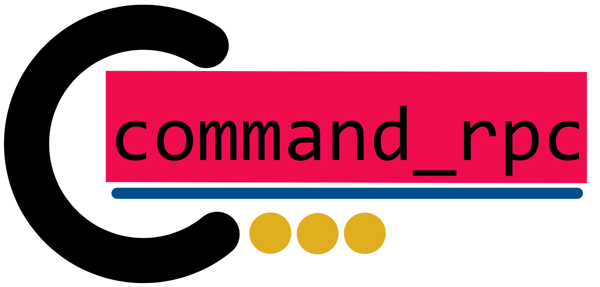

<!-- 
     
 -->

A `command-line` rpc written in Rust. It build on top of the well-known king of rust cli crates, `clap`.
Most of its features are preserved but the usage of `command_rpc` shortens the boilerplate code.

**Official release: May 29th - There is going to be a tutorial on youtube, also linked here!**

## Why to use `command_rpc`

### What `crpc` is made for

+ lightweightness
+ efficience
+ export to any language
+ calls from user or other programs

Of course, that could be a disadvantage, you should not use `crpc` for big and well-defaultized
transfer protocolls - and you may not use it for i/o-intense programs.


### Advantages to pure `clap`

+ more concise and less redundant due to less boilerplate
+ inherited type hints in the help text of the cli
+ all clap features persist due to expansion

+ being easy-to write and beginner friendly


## Usage of `command_rpc`

### Installation

Run `cargo add command-rpc` shell command or insert `command-rpc = "*"` in your Cargo.toml.
Just now, in `v0.1.11` this tools stands at the beginning of its development.


### How to use `crpc`

1. Add `command-rpc` as dependency.
2. Write a `crpc` module that has the `#[crpc_main]` attribute. The functions (that need to be public!)
 in it you annotate with `#[crpc_fn]` is going to be nested as command, and (public) modules with
 `#[crpc_mod]` included as subcommand, its inner (public) functions will be included too. Also comments
 will be extracted out of the function signature - other comments are extracted like working with clap.
 (Better check out our examples --> https://docs.rs/command-rpc/0.1.11/command_rpc/ )
3. Import the needed proc macros with `use command_rpc::*`.
4. Give the `main.rs` file access to this module. Your `main` function looks as follows:

    ```rust
    fn main() {
      [name of your crpc_main module, first letter kapital]_::parse().delegate();
    }
    ```

5. Now you can expand, build or compile your program. Don´t worry about error reports at first, most of them
disappear after first build and expansion. Check out **Advices** below for more information about usage recommendations and things that might not work correctly yet.


### Advice

+ Use `cargo expand` to take a look on the generated code. You have to run `cargo install cargo-expand` first!
Unfortunately you will see all expansions even coming from `clap`.
+ For now, `v0.1.11`, it is not intended to have any output. You can use `(e)print(ln)!` to let your cli return something. Furthermore, only native types as input types are intended. Feel free to force the user know about rust syntax for giving objects as input, instead you could use a string as (json) file path.
+ For the moment it is not possible to give commands with nested subcommands arguments because the function - having the same identifier in your written code - would expand to a struct with the same name which causes problems. An attribute is only allowed to manipulate the given code so this would be difficult to implement but could be possible in a newer version than `v0.1.11`.
+ When developing more complex command line applications, know about `clap` for more benefits regarding integration between `clap` and `command_rpc`!


## Contribution

To do so, you may write for longer collaboration a message to me (Mail: loos-johannes@gmx.de, Instagram: lsjohannes), or open directly a pr.

---

## Version overview/preview


+ `v0.1.11`: first working version
+ `v0.1.12`, *new feature*: commands with nested subcommands are able to have own functionality and arguments
+ `v0.1.13`, *new feature*: easy version management by just adding version ranges for each command
+ `v0.1.14`, *feature extension*: diffrent functions with same name but disjoint version ranges coexist